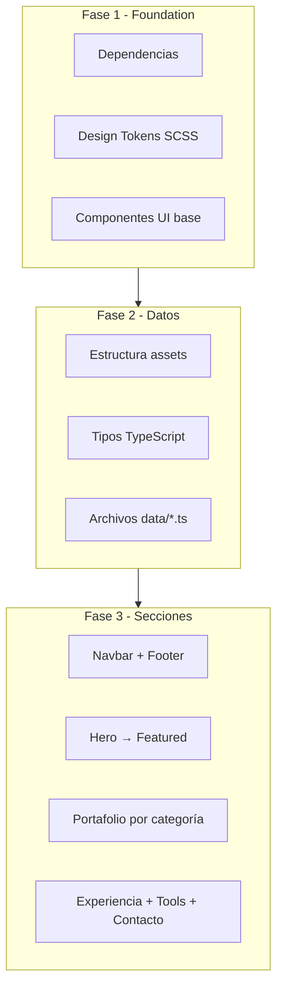
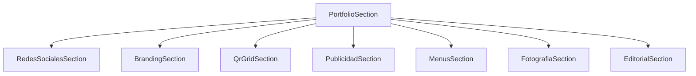

# Plan de implementación – Portafolio Web SPA (Vue 3 + Vite)

## Estado actual

El repo [`porfolio-maria`](C:\Users\gedua\Documents\Portafolios\Maria\porfolio-maria) es un scaffold mínimo: solo [`src/App.vue`](src/App.vue), [`src/components/HelloWorld.vue`](src/components/HelloWorld.vue) y [`src/style.css`](src/style.css). **No hay** Vue Router, SCSS, estructura de carpetas ni contenido de portafolio.



---

## Fase 1: Fundamentos y tooling

### Dependencias a instalar

| Paquete | Uso |
|---------|-----|
| `vue-router` | SPA con vista única + navegación por anclas |
| `sass` | SCSS según especificación |
| `lucide-vue-next` | Iconografía Lucide |
| `@vueuse/core` | Scroll spy, intersection observer, gestos |
| `vue-easy-lightbox` | Lightbox fotografía |
| `vue-pdf-embed` | Visor editorial integrado (PDF en-app, sin descarga directa) |

**No instalar** backend de formularios. La sección Contacto solo expone `mailto:` y LinkedIn.

### Configuración Vite

Actualizar [`vite.config.ts`](vite.config.ts):
- Alias `@` → `src/`
- Preprocessor SCSS con import global de tokens: `@use '@/styles/abstracts/variables' as *;`

### Estructura de carpetas (según spec)

Crear el árbol completo bajo `src/`:

```
src/
├── assets/portfolio/...     ← assets reales organizados por categoría
├── components/ui/           ← BaseButton, BaseCard, BaseSection, etc.
├── components/layout/       ← AppNavbar, AppFooter, ScrollTop
├── components/{hero,about,services,featured,portfolio,...}/
├── composables/             ← useScrollSpy, useHorizontalScroll, useLightbox
├── data/                    ← Contenido tipado (profile, services, portfolio, etc.)
├── router/index.ts
├── styles/                  ← abstracts, base, components, layout, utilities, animations
└── views/HomeView.vue       ← Vista única con todas las secciones
```

Eliminar [`HelloWorld.vue`](src/components/HelloWorld.vue) y migrar de [`style.css`](src/style.css) a [`styles/index.scss`](src/styles/index.scss).

### Vue Router

Una sola ruta `/` → `HomeView`. La navbar usará scroll suave a IDs de sección (`#hero`, `#about`, `#portfolio`, etc.) vía composable `useScrollSpy` con `@vueuse/core`.

---

## Fase 2: Design System SCSS

Implementar tokens en [`src/styles/abstracts/_variables.scss`](src/styles/abstracts/_variables.scss) y mixins en [`_breakpoints.scss`](src/styles/abstracts/_breakpoints.scss):

- **Breakpoints:** 480 / 768 / 1024 / 1280 / 1536 px
- **Container:** max-width 1280px, width 90%
- **Espaciado:** escala fija 4–128 px (sin valores fuera de escala)
- **Grid:** 4 cols mobile → 8 tablet → 12 desktop
- **Tipografía:** Inter (body) + **Outfit** (headings; elegir Outfit como default, fácil cambiar a Poppins)
- **Colores:** palette base del spec + `--color-accent` como variable CSS pendiente de identidad visual (valor provisional `#C4A882` tono editorial neutro, reemplazable en un solo token)
- **Radius, sombras (small/large), transiciones 250ms, hover translateY(-4px)**

Fuentes via Google Fonts en [`index.html`](index.html).

---

## Fase 3: Componentes UI reutilizables (Atomic Design adaptado)

Todos los componentes de sección se componen **solo** de estos bloques:

| Componente | Responsabilidad |
|------------|-----------------|
| `BaseContainer` | max-width + padding horizontal |
| `BaseSection` | padding vertical de sección + `id` para anclas |
| `BaseTitle` | H1–H4 con escala responsive |
| `BaseButton` | variantes primary/secondary/ghost, icono opcional |
| `BaseCard` | surface, radius 16px, shadow-small, hover lift |
| `BaseBadge` | indicadores rápidos (Sobre mí) |
| `BaseDivider` | separador entre bloques de portafolio |

Componentes de layout:
- **`AppNavbar`:** links a secciones, sticky, menú hamburguesa mobile
- **`AppFooter`:** créditos + links sociales
- **`ScrollTop`:** botón flotante tras scroll

---

## Fase 4: Capa de datos y assets reales

### Estructura de assets (integrar los reales desde el inicio)

Organizar en `src/assets/portfolio/`:

```
portfolio/
├── smartcultivo/
│   ├── social/
│   ├── branding/      (carnet, carpeta, firma)
│   ├── qr/
│   └── flyers/
├── thissa-store/
│   ├── social/
│   ├── qr/
│   ├── flyers/
│   ├── pop/
│   └── menus/         (digital + físico)
├── bar-osiris/
│   ├── social/
│   └── flyers/
├── fotografia/
└── editorial/         (PDFs)
profile/
└── hero-photo.jpg
```

### Archivos de datos tipados en `src/data/`

```typescript
// Ejemplo de interfaces clave
interface FeaturedProject { id, name, image, summary }
interface BrandBlock { brand, intro, items[] }
interface QrItem { image, name, description, url }
interface MenuItem { mockup, name, description, onlineUrl? }
interface TimelineEntry { year, title, company, description }
interface Tool { name, icon }
interface ContactLink { type: 'email' | 'linkedin', label, href }
```

Archivos separados: `profile.ts`, `services.ts`, `featured.ts`, `portfolio.ts`, `experience.ts`, `tools.ts`, `contact.ts`.

**Acción requerida al iniciar implementación:** recibir/ubicar la carpeta de assets reales del usuario en la estructura anterior; mapear cada archivo a su entrada en los `.ts` de datos.

---

## Fase 5: Secciones principales (orden de la página)

Vista [`HomeView.vue`](src/views/HomeView.vue) compone todas las secciones en orden:

### 1. Hero (`HeroSection`)
- Layout 2 columnas desktop / vertical mobile
- Nombre, especialidad, descripción corta, foto profesional
- Botones: "Ver Portafolio" → scroll a `#portfolio`, "Contactar" → `#contact`
- Altura ~100vh, sin sobrecarga visual

### 2. Sobre mí (`AboutSection`)
- Texto breve + `BaseBadge` indicadores (años experiencia, empresas, especialidades)

### 3. Servicios (`ServicesSection`)
- Grid desktop / stack mobile
- Cards solo con área de trabajo (Branding, Social Media, Publicidad, Editorial, Fotografía, Marketing Digital)

### 4. Proyectos Destacados (`FeaturedSection`)
- 3 cards verticales: SmartCultivo, Thissa Store, Bar Osiris (imagen + resumen, **sin** casos de estudio ni rutas nuevas)
- Botón "Explorar Portafolio" → scroll a `#portfolio`

---

## Fase 6: Portafolio por categoría

Sección contenedora `PortfolioSection` con sub-secciones independientes, cada una con `BaseSection` + `BaseTitle` + patrón de presentación específico:



| Sub-sección | Patrón UI | Comportamiento |
|-------------|-----------|----------------|
| **Redes Sociales** | 3 bloques (marca → intro → carrusel) | Desktop: scroll horizontal o grid; **Mobile: carrusel táctil** con CSS scroll-snap + swipe |
| **Branding Corporativo** | 3 piezas simultáneas (carnet, carpeta, firma) | Grid fijo, sin carrusel |
| **QR Interactivos** | Grid 4 cols desktop / 2 cols mobile | Card: QR escaneable + nombre + descripción + botón "Abrir" |
| **Publicidad – Flyers** | Grid/Masonry | Piezas independientes, sin carrusel |
| **Publicidad – POP** | Grid | Piezas independientes |
| **Menús** | Scroll horizontal con mockups en dispositivo móvil | Click opcional: expandir card + link menú online |
| **Fotografía** | Masonry (CSS columns) | Click → lightbox con zoom y navegación |
| **Editorial** | Visor PDF integrado (`vue-pdf-embed`) | Slider/swipe entre páginas; simula lectura; **sin** descarga directa del PDF |

Componentes portfolio reutilizables:
- `BrandCarousel` / `TouchCarousel` (scroll-snap)
- `QrCard`
- `FlyerGrid`, `PopGrid`
- `MenuScroll` (horizontal scroll + mockup frame)
- `PhotoMasonry` + wrapper lightbox
- `EditorialViewer` (paginación + swipe mobile)

---

## Fase 7: Experiencia, Herramientas y Contacto

### Experiencia (`ExperienceSection`)
- Timeline horizontal en desktop (flex + línea conectora)
- Timeline vertical en mobile (stack)
- Datos desde `experience.ts`

### Herramientas (`ToolsSection`)
- Grid de logos/nombres: Illustrator, Photoshop, Canva, CapCut, Office
- **Sin porcentajes de dominio**

### Contacto (`ContactSection`)
- **Solo dos canales:** correo (`mailto:`) y LinkedIn
- Sin WhatsApp, Instagram ni formulario
- Layout minimalista con dos cards/botones clicables (iconos Lucide: `Mail` y `Linkedin`)
- Datos en `contact.ts` con únicamente esas dos entradas

---

## Fase 8: Responsive y pulido final

### Estrategia Mobile First
- Estilos base en mobile; `@include breakpoint(md/lg/xl)` para ampliar
- **Nunca eliminar contenido** en mobile; solo reorganizar

### Checklist responsive por sección

| Sección | Mobile | Desktop |
|---------|--------|---------|
| Hero | Vertical | 2 columnas |
| Servicios | Stack | Grid |
| Destacados | Cards verticales | 3 cards fila |
| Redes Sociales | Carrusel táctil | Bloques con carrusel interno |
| QR | 2 columnas | 4 columnas |
| Flyers | 1 columna | Grid/Masonry |
| Menús | Scroll horizontal swipe | Scroll horizontal |
| Fotografía | Masonry 1 col | Masonry multi-col |
| Timeline | Vertical | Horizontal |
| Editorial | Swipe páginas | Visor con controles |

### Animaciones globales
- Transición única 250ms en hovers de cards y botones
- Entrada suave de secciones con `@vueuse/core` `useIntersectionObserver` (fade-in opcional, sutil)

### SEO y meta
- Actualizar [`index.html`](index.html): lang `es`, title, description, Open Graph básico

---

## Orden de implementación recomendado

1. Tooling + SCSS tokens + componentes UI base
2. Router + HomeView shell + Navbar/Footer
3. Capa de datos + integración assets reales
4. Secciones simples: Hero → About → Services → Featured
5. Portafolio (de simple a complejo): Branding → QR → Flyers/POP → Redes Sociales → Menús → Fotografía → Editorial
6. Experience → Tools → Contact → Footer
7. Responsive pass + accesibilidad (focus, alt texts, contraste)
8. Build de producción + verificación `npm run build`

---

## Decisiones registradas

- **Assets:** integración real desde el inicio (usuario provee carpeta)
- **Contacto:** solo `mailto:` y LinkedIn (sin WhatsApp, Instagram ni formulario)
- **Heading font:** Outfit (cambiable vía token)
- **Accent color:** token CSS provisional, pendiente identidad visual final
- **Editorial:** visor PDF embebido con paginación/swipe (no flipbook 3D; más ligero y mantenible)
- **Router:** vista única; navegación intra-página por anclas

## Entregable al confirmar el plan

SPA funcional desplegable (`npm run build`) con design system completo, todas las secciones especificadas, assets reales mapeados, y experiencia responsive mobile-first coherente con la filosofía minimalista/editorial del proyecto.
